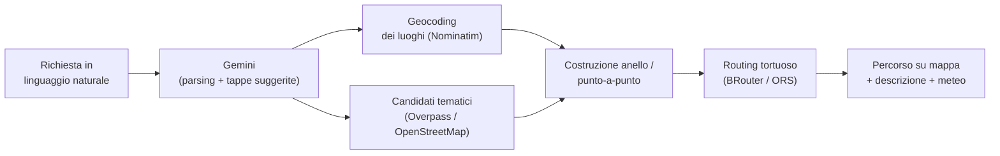
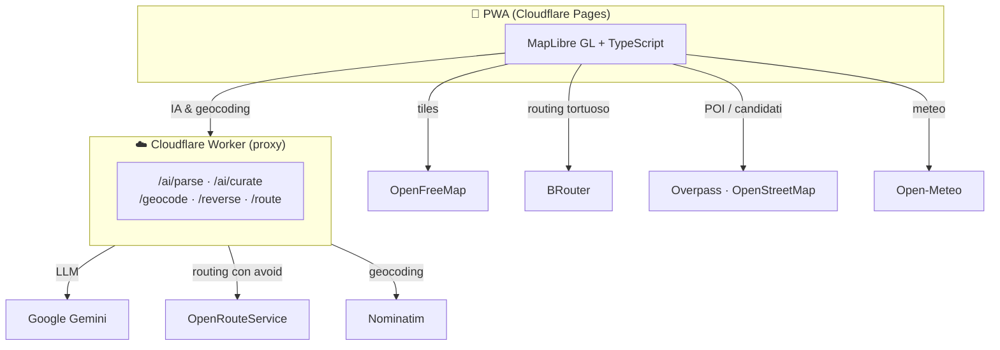

<div align="center">


# MotoRoute

### **Smart Route, better rides**

Pianificatore di percorsi in moto con **mappa reale**, **routing tortuoso** che evita autostrade e superstrade, e un'**IA che costruisce itinerari tematici** dalle tue parole.

<br/>


</div>

---

## ✨ Cosa fa

MotoRoute nasce per rispondere a una domanda semplice: *"portami a fare un bel giro"* — e trasformarla in un percorso vero, guidabile, ricco di curve e di cose belle da vedere.

| | |
|---|---|
| 🗣️ **IA che crea itinerari** | Scrivi in linguaggio naturale (*"anello di 200 km verso le montagne"*, *"giro della Val d'Orcia"*, *"anello che passa per Castelluccio di Norcia"*) e l'IA non ti porta solo lì: costruisce un **percorso tematico** coerente con la richiesta, scegliendo tappe iconiche reali. |
| 🛣️ **Routing tortuoso** | Un profilo di routing dedicato privilegia strade tranquille e curve, **evitando autostrade e superstrade** (non solo le autostrade — anche le trunk/superstrade italiane). |
| 🔁 **Anelli** | Genera un anello a partenza = arrivo, con distanza e direzione a scelta, oppure *"sorprendimi"*. |
| ✏️ **Modifica manuale** | Tocca la mappa per aggiungere tappe, trascina i punti per correggere, riordina o rimuovi le tappe. |
| 📝 **Descrizione con consigli** | L'IA genera una breve descrizione del giro con un **consiglio pratico**. |
| 🌦️ **Meteo del giro** | Previsioni a partenza, metà e arrivo, sempre visibili. |
| 🌄 **Punti di interesse** | Panorami, valichi e benzinai reali sovrapposti alla mappa. |
| 🧭 **Naviga davvero** | Apri il percorso in **Google Maps** (con waypoint e *evita autostrade*) o esporta un **GPX** per OsmAnd e navigatori. |
| ⭐ **Salva** | Percorsi preferiti e partenze salvate ("basi"), con una **partenza preferita** caricata all'avvio. |
| 📱 **PWA offline-friendly** | Si installa sul telefono e funziona come un'app nativa. Nessuna chiave, nessuna configurazione sul dispositivo. |

---

## 🧠 Come funziona l'IA

L'intelligenza dell'app non "inventa" luoghi: **propone e poi valida sui dati reali**.



1. **Comprensione** — Gemini interpreta la frase e ne estrae modalità (anello / punto-a-punto), distanza, direzione, temi e luoghi/tappe suggerite.
2. **Validazione** — ogni luogo suggerito viene geocodificato: se non esiste davvero, non entra nel giro.
3. **Arricchimento tematico** — per i temi (curve, panorami, borghi…) i candidati arrivano da OpenStreetMap via Overpass, così i nomi sono reali.
4. **Percorso** — le tappe diventano un anello o un punto-a-punto, tracciato da un motore di routing vero.
5. **Racconto** — l'IA scrive una descrizione con un consiglio, affiancata dal meteo.

---

## 🏗️ Architettura



Le **chiavi vivono solo nel Worker** (mai nel repo, mai sui dispositivi). Il client resta keyless: qualsiasi telefono apre la PWA e funziona senza configurazione.

---

## 📚 Appendice — API e tecnologie per funzionalità

Quali servizi/tecnologie alimentano ogni pezzo dell'app.

### Interfaccia e base

| Funzionalità | Tecnologia / API | Note |
|---|---|---|
| App & build | **Vite + TypeScript**, PWA (manifest + service worker) | Static app, installabile |
| Mappa interattiva | **MapLibre GL JS** | Rendering vettoriale |
| Tile della mappa | **OpenFreeMap** (stile *Liberty*) | Gratuito, **keyless** |
| Hosting | **Cloudflare Pages** | Tier gratuito |

### Intelligenza artificiale

| Funzionalità | Tecnologia / API | Note |
|---|---|---|
| Parsing richiesta in linguaggio naturale | **Google Gemini** (`gemini-flash-latest`) | Structured output via `responseSchema` |
| Scelta tappe tematiche + spiegazione | **Google Gemini** | Sceglie tra candidati **reali** |
| Descrizione del giro con consigli | **Google Gemini** | 2-3 frasi + consiglio pratico |
| Proxy sicuro delle chiavi | **Cloudflare Worker** | Custodisce `GEMINI_API_KEY` e `ORS_API_KEY` |

### Routing e geodati

| Funzionalità | Tecnologia / API | Note |
|---|---|---|
| Routing tortuoso / evita autostrade+superstrade | **BRouter** + profilo "strade tranquille" personalizzato | Pubblico, **keyless** |
| Routing con *avoid* nativo (fallback) | **OpenRouteService** (via Worker) | Chiave gratuita nel Worker |
| Geocoding (nome → coordinate) e reverse | **Nominatim / OpenStreetMap** (via Worker) | Con cache edge e User-Agent |
| POI (panorami, valichi, benzinai) e candidati tematici | **Overpass API / OpenStreetMap** | Con **mirror** di fallback |

### Contesto e navigazione

| Funzionalità | Tecnologia / API | Note |
|---|---|---|
| Meteo del giro | **Open-Meteo** | **Keyless** |
| Apri in Maps con waypoint | **Google Maps** URL (`avoid=highways,tolls`) | Fino a ~8 waypoint campionati |
| Navigazione esatta | Export/Import **GPX** + **Web Share API** | Per OsmAnd e navigatori |
| Preferiti e partenze salvate | **IndexedDB** + **localStorage** | Tutto locale sul dispositivo |

---

## 🚀 Sviluppo locale

```bash
npm install
npm run dev
```

Serve un file `.env` con l'URL del Worker (vedi `.env.example`):

```
VITE_WORKER_URL=https://<il-tuo-worker>.workers.dev
```

Build di produzione e test:

```bash
npm run build
npm test
```

### Pubblicare online

Il sito di produzione è **https://motoroute-97c.pages.dev** (Cloudflare Pages, *direct upload*).
Non è collegato a GitHub: **un `git push` non pubblica il sito**. Per andare online:

```bash
npm run deploy
```

Il Worker (proxy delle chiavi) si aggiorna a parte:

```bash
npm run worker:deploy
```

Il setup completo (Worker + Pages, tutto sul tier gratuito) è documentato in **[DEPLOY.md](DEPLOY.md)**.

---

## 💸 Costo & privacy

- **~€0**: ogni servizio usato è gratuito o keyless; le chiavi che servono stanno nel piano free di Cloudflare.
- **Privacy**: percorsi, preferiti e partenze restano **sul tuo dispositivo** (IndexedDB / localStorage). Nessun account, nessun tracciamento.

<div align="center">
<br/>
<sub>Fatto per andare a fare bei giri. 🏍️</sub>
</div>
